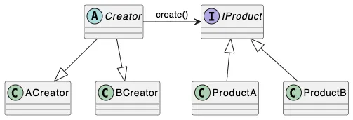

[[GRASP]]
Суть пораждающих паттернов заключается в абстракции над механизмами создания обьектов. Применяются для того, чтобы отделять логику создания обьектов, от логики выполнения операций. 

**Factory Method** 
Суть паттерна заключается в вынесении логики создания обьектов, нужных при выполнении какой-либо операции в абстрактные методы типа, содержащего логику операции, эти методы будут реализованы типами наследниками. 

Состоит из двух иерархий: иерархия Creator и иерархие Product

Плюсы
Механизм отделяет создание обьектов и операции бизнес логики, с такой точки зрения соблюдается SRP (ну почти)
Механизм позволяет поддерживать OCP, так как можно добавлять реализации для любых новых типов без изменения кода самой операции.
Минусы
Механизм вводит необязательную связанность типов через наследование. Композиция в любом случае лучше наследования, так как наследование тесно связывает типы на этапе компиляции. Иерархии типов не достает модульности, в любом случае вместо фабричного метода стоит использовать абстрактные фабрики. 
Так как конкретные создатели, жестко привязаны к реализации операции базового класса, добавление новой вариации реализации операции будет вести к дубликации конкретных создалей. 

**Abstract Factory** 
Этот паттерн является усовершенствованной версией паттерна фабричный метод. При реализации абстрактной фабрики, мы полностью отделяем реализацию создания обьектов от реализации операций. 
Фабрика - обьект, у которого есть набор фабричных методов, задачей которого является только создание обьектов из набора иерархий, которые фабрика поддерживает. Абстрактая она потому, что ее фабричные методы возвращают абстракции иерархий обьектов (абстрактные классы, интерфейсы)
	В большенстве источников целью фабрики указывают создание семейства абстрактых обьектов, но ничего не мешает создавать фабрику для одной иерархии.

Плюсы
В отличие от фабричного метода, абстрактная. фабрика по-настоящему отделяет создание обьектов от выполнения операций, соответственно соблюдается SRP
Так же соблюдается OCP, так как добавления новой комбинации создаваемых обьектов, нужно добавить новую реализацию фабрики. 

Различие фабрики, фабричного метода и абстрактной фабрики
Фабрика отвечает за создание обьектов одним методом, определяющим нужный класс на основе параметров. 
Фабричный метод использует наследование и позволяет подклассам определять тип создаваемого обьекта.
Абстрактная фабрика управляет целыми семействами связанных обьектов, не указывая их конкретные классы.

**Builder**
Паттерн строитель является абстракией над вызовом сложных конструкторов обьектов. Паттерн предоставляет возможность собирать обьекты пошагово, и/или без указания некоторых аргументов. Строитель может быть абстрактным, создавать в итоге обьекты различных типов из иерархии. 

Главная идея паттерна - отделение логики агрегации аргументов, от самой логики создания обьектов

Строитель предоставляет методы для задания обьекту различных атрибутов (пример на машине: двигатель, цвет кузова, подвеска и так далее), соответственно метод Build создает обьект с заданными характеристиками. 
В рамках паттерна строитель существует еще одна абстракция - директор. Директор - это набор сценариев использования строителя. Директор хранит в себе обьект строителя и предоставяет пользователю методы, содержащие набор вызовов методов строителя, таким образом, директор содержит в себе часто используемые сценарии использования строителя. 
В шарпах директоры могут быть реализованы в виде методов расширения, так как полиморфизм обеспечивается на уровне строителя, так что директор как отдельный обьект не особо нужен. 
В примере данном на диаграмме есть две сущности: машина и инструкция к ней. ДЛя создания инструкции к машине, требуется та же информация как и для создания самой машины, соответственно у их строителей будет общий интерфейс. В примере существвует директор, в нем реализованы методы для создания внедорожника и спортивной машины. 
![[Pasted image 20241123021002.png]]
Реализация
Конкретный строитель должен иметь поля, дублирующие параметры конструктора создаваемого обьекта. При вызове метода Build, должен создаваться новый обьект, через вызов конструктора. Ни на каком этапе, в строителе не должен храниться созданный обьект. Заданные через методы строителя значения должны быть провалидированны на наличие значений, при отсутствии, должен быть выкинут эксепшен, либо предоставлено дефолтное значение, если реализация билдера это подразумевает. 

> [Виды билдеров]
> Convenience builder
> Данный строитель, используется для упрощения создания обьектов с большими конструкторами. Такие строители могут быть спокойно определены отдельно от типов, которые они конструируют, так как строитель должен делать лишь тривиальную валидацию подаваемых значений, а вся логика валидации находится в конструкторе создаваемого типа. 
>Stateful Constructor Builder
>Данный строитель используется когда агрегация данных для конструирования делается пошагово. По сути это конструктор, имеющий стейт. 
>Юзкейсами могут быть коллекции обьектов в параметрах конструктора, когда получение значений обьектов реализуется не в одном месте, а в нескольких (Например значения получаются на разных View в UI)
>_
>Stateful Constructor отличается от Convenience тем, что на нем лежит логика валидации входящих данных, фактически он является конструктором типа, имеющим какое-либо состояние. 
>_
>Stateful constructor builder обычно используется для создания соделей, следовательно основаная логика будет как раз логикой конструирования. 
>_
>Так как такой билдер непосредственно инкапсулирует логику валидации, то конструктор модели будет ее лишен, и создание модели через него должно быть невозможно через клиентский код (иначе прийдется дублировать ее в конструкторе). Такая проблема решается путем реализации билдера в виде вложенного класса и приватного конструктора самой модели. 

Смешение билдеров
	Когда созданный билдер становится смесью Convenience и Stateful Constructor, то скорее всего вы смешали в конструируемом типе слишком много зависимостей. 
	Зачастую лучшим решением будет выделение той части значений, которая требует Stateful Constructor инициализации в отдельную модель, и написание пошагового билдера для нее. 
	В целом это не железное правило, реализации строителя сильно зависит от создаваемого типа (НЕ НАОБОРОТ), так что различные вариации возможны, но в рамках лаб не надо. 

Interface Driven Builder
	При реализации строителей, может возникнуть надобность в задании обязательных аргументов для обьекта. Для того, чтобы контракты кода соблюдались, нужно энфорсить их так, чтобы без их соблюдения компиляция была невозможна. Другими словами, не через документацию к проекту, где говориться о том, какие методы нужно обязательно вызывать на строителях.
	_
	Первое наивное решение - параметры конструктора строителя. Если мы добавим в конструктор строителя обязательные параметры, то сам объект строителя нельзя будет создать их не указав. Основное преимущество такого подхода - простота, но недостатки у него тоже есть. Мы возвращаемся к вызову конструктора, вызов которого совершенно не похож на fluent-API строителя, что с определённого количества параметров будет сильно выделяться.
	Решением такой проблемы с сохранением fluent-API являются интерфейсно-направленные строители.
	Их суть довольно простая. Разбить методы строителя на интерфейсы. Для задания каждого обязательного аргумента должен быть свой интерфейс, метод которого должен иметь возвращаемый тип - интерфейс для задания следующего обязательного аргумента. Метод последнего интерфейса обязательного аргумента должен возвращать интерфейс для задания необязательных аргументов и создания объекта.

**Prototype**
Паттерн, предназначенный для инкапсуляции операции копирования обьектов внутри самих обьектов. Использование этого паттерна имеет преимущество над созданием копии извне, так как структура обьекта может быть недоступна извне, также тип копируемого обьекта может находится в иерархии, и клиентский код может не знать конкретный тип копируемого обьекта. 
![[Pasted image 20241123021440.png]]
Реализация
Прототип может быть реализован как обобщенный тип, используя рекурсивные женерики (передача типа, реализующего интерфейс как аргумент типа); 

**Singleton**
Паттерн применяемый для гарантии наличия одного обьекта на время выполнения кода системы. 
Стандартно реализуется наличием статического поля в типа синглтона, инициализируемого при запросе к значению вызовом. 

Для потокобезопасности используется подход double check lock. Первый раз проверяем, было ли инициализированно значение ранее, вторая проверка нужна, чтобы убедится не был ли инициализирован обьект другим потоком, пока текущий висел на локе. 

В шарпах можно использовпть тип Lazy<T> для инициализации значения, его конструктор принимает настройки потокобезопасности
- `None` - не гарантируется потокобезопасность, при инициализации несколькими потоками одновременно, фабричный метод вызовется несколько раз, значение, оставшееся в ленивом объекте будет инициализировано одним из потоков, каким - неопределенно.
- `PublicationOnly` - при данной опции фабричный метод так же вызовется много раз, если несколько потоков начнут инициализацию одновременно, но значение в ленивом объекте будет инициализированно тем, что было создано первым зашедшим потоком.
- `ExecutionAndPublication` - данная опция гарантирует полную потокобезопасность. Фабричный метод будет вызыван только один раз.

Проблемы
	Тестирование
	Внедрение зависимостей
	Время жизни обьекта
	Статический стейт
Решения
	Решением всех этих проблем довольно простоей - не делать синглтон. В реальных приложениях используются LoC(DI) контейнеры, так что для создания синглтона в рамках проектируемой системы, можно добавлять обьекты с Singleton лайфтаймом. 